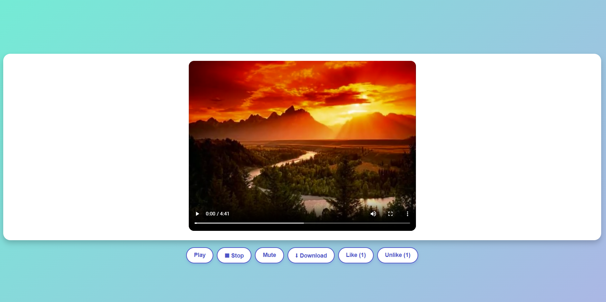

# Video Player Interativo

Um reprodutor de vídeo web com controles personalizados e funcionalidades interativas, desenvolvido com HTML, CSS e JavaScript.

 

## Funcionalidades

- ▶️ Play/Pause: Controla a reprodução do vídeo
- ⏹ Stop: Para a reprodução e retorna ao início
- 🔇 Mute/Unmute: Alterna entre mudo e com áudio
- ⬇ Download: Baixa o vídeo para o dispositivo
- 👍 Like/👎 Unlike: Sistema simples de feedback com contadores
- Reprodução automática e loop contínuo

## Tecnologias Utilizadas

- HTML5
- CSS3 (com gradientes e efeitos visuais)
- JavaScript (para interatividade)
- Fontes do Google (Poppins)

## Como Usar

1. Clone este repositório
2. Abra o arquivo `index.html` no seu navegador
3. Substitua o vídeo `video/Tema.mp4` pelo seu próprio vídeo se desejar

## Personalização

Você pode facilmente personalizar:
- Cores no arquivo `styles.css`
- Vídeo substituindo o arquivo na pasta `video/`
- Botões adicionais no `script.js`

Veja o projeto funcionando ao vivo:

👉 [Eduardo Peçanha — Projeto Online](https://eduardopec.github.io/manipularVideo/)
 
## 🚀 Como Executar
1. Clone o repositório:
   ```bash
   git clone https://github.com/EduardoPec/manipularVideo
